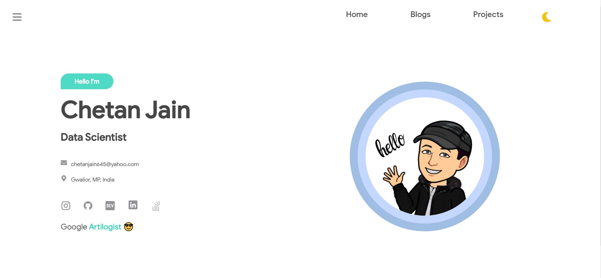
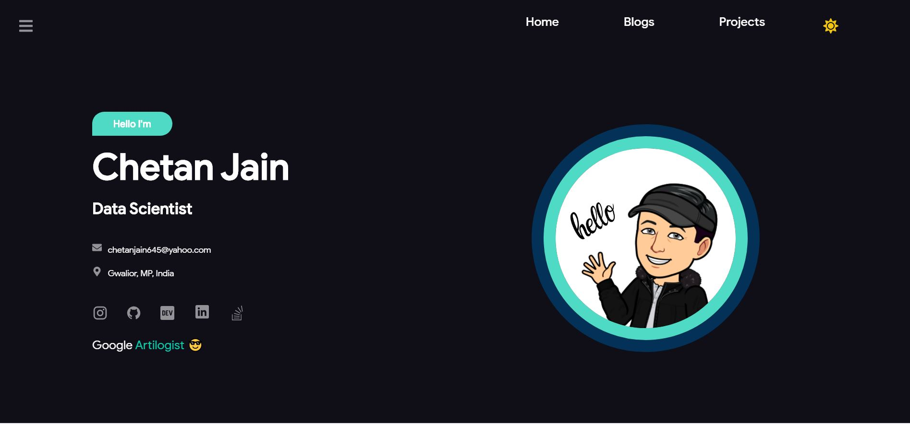
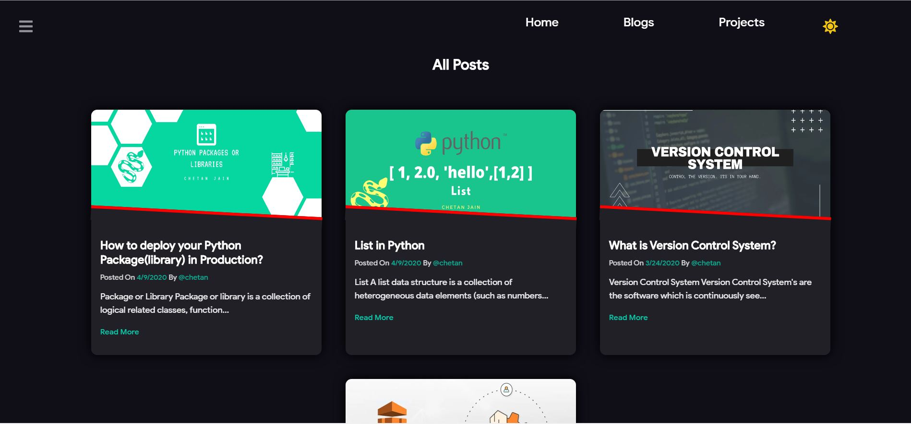
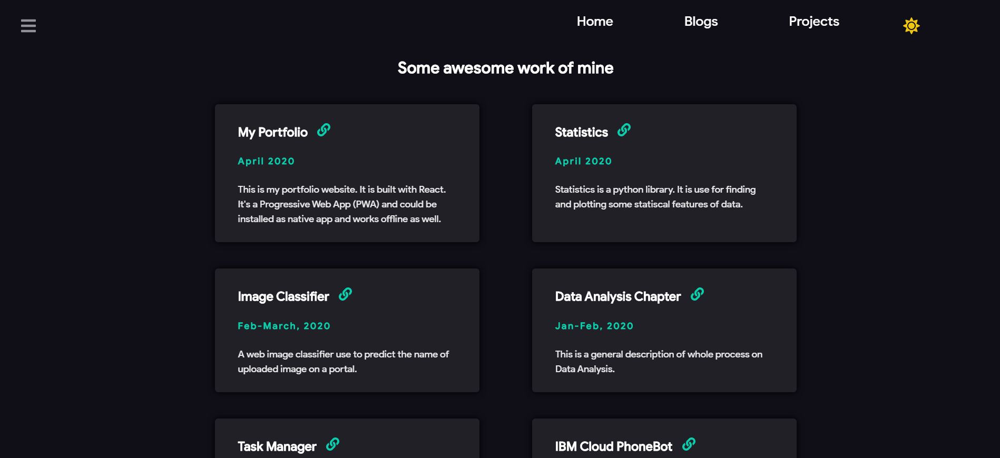
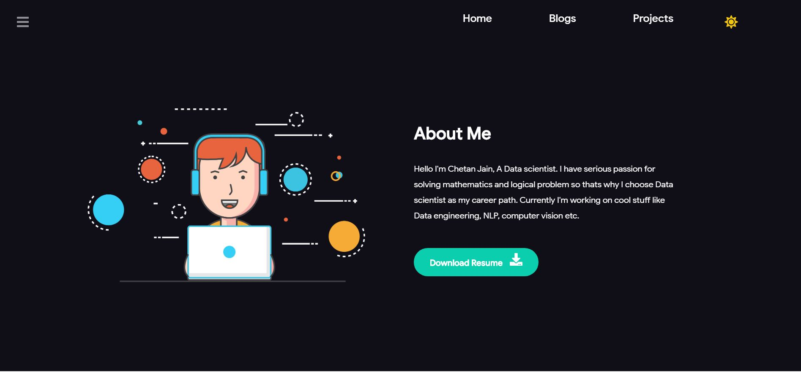

# My Portfolio PWA (Progressive Web App)

[](https://opensource.org/licenses/MIT)

## [live Demo](https://artilogist.tech)










## Instructions

1. Clone this repo

2. To install dependencies

```
$ npm install
```

3. To run

```
$ npm start
```
